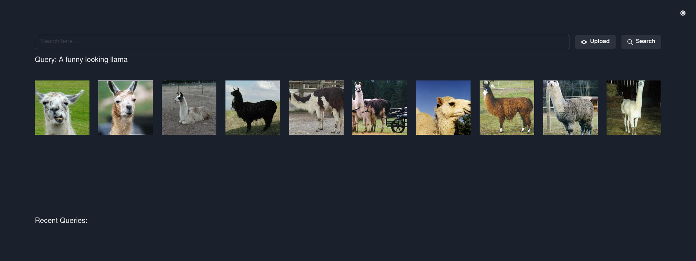
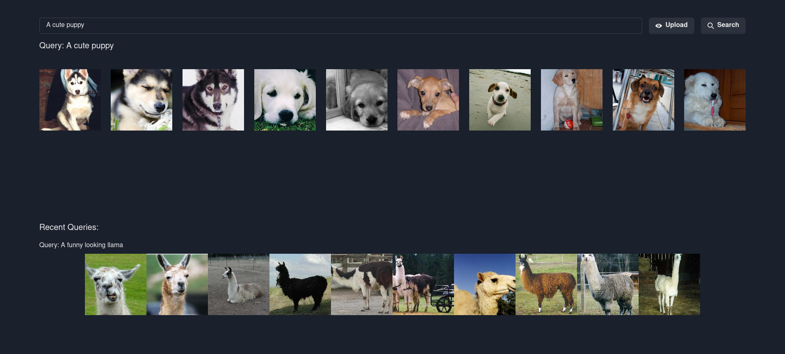
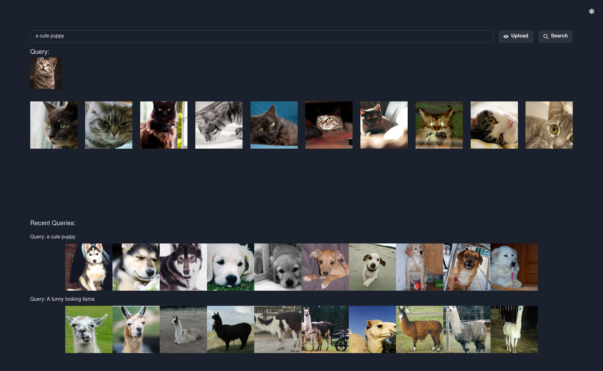
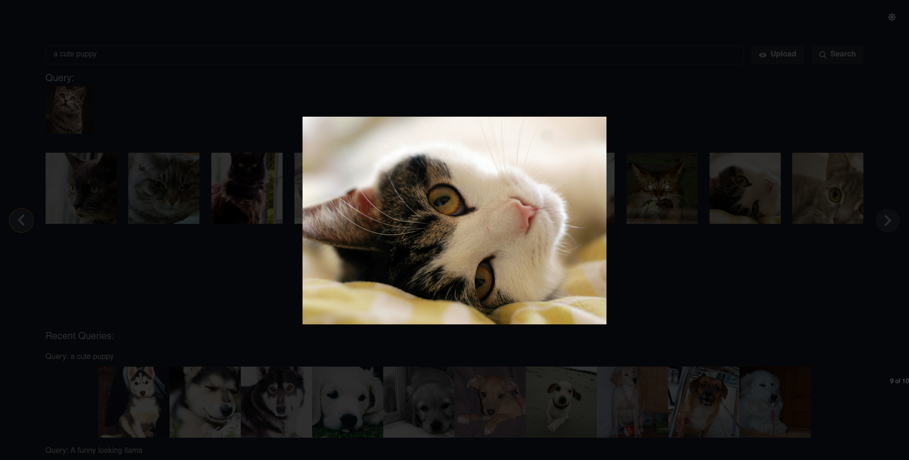

# LanternDB Semantic Image Search
This project aims to provide a simple web interface providing CLIP based semantic image search backed by LanternDB

## TL:DR

This project assumes you have a Postgres installation running (locally) with [lanterndb](https://github.com/lanterndata/lanterndb) and [lanterndb_extras](https://github.com/lanterndata/lanterndb_extras) installed. Installation instructions for these extensions can be found in their respective repos. 

I include scripts to download the cal-tech-256 image dataset and insert it into the database (on a g4dn.xlarge this takes about an hour). You can use any dataset you like, there's a python script to load [COCO](http://cocodataset.org/) into lantern as well `load_coco.py`. 
```
CREATE EXTENSION lanterndb;
CREATE EXTENDION lanterndb_extras;
CREATE TABLE IF NOT EXISTS image_table (
	v REAL[],
	location VARCHAR,
	id SERIAL PRIMARY KEY
);
CREATE INDEX semantic_image ON image_table USING hnsw (v dist_cos_ops) WITH (M=5, ef=30, ef_construction=30, dims=512);
```
This should be sufficient to use the app, though without any embeddings the search will not be especially interesting. If you'd like to insert a few embeddings just to check it out you can run the following query on a few images 
```
INSERT INTO image_table (v, location) VALUES (clip_image('/path/to/your/file'), '/path/to/your/file');
```

## Building the project
Once you have the database set up you can use the app. You'll need npm/yarn as well as the go runtime. `backend/go.mod` is set up for `1.21.1` but the project should work with most recent versions of the language, just change it to match whatever is on your system. you will also have to edit `backend/main.go` (and if you wish to use them both python loaders) with your databse credentials. If there's interest I can add argparsing to make this smoother

To build the backend you can run
```
cd backend
go get
go build
```

To build the frontend you can run
```
cd frontend
yarn install
yarn build
# if you want to run a test server you can instead run 
yarn start
```
#### Note:
The routes in `frontend/src/App.js` are configured with deployment in mind. If you do not want to install the app and only want to test you can swap the routes with the following command
```
sed -i 's/\/api/http:\/\/<your-ip>:8080\/api/g' frontend/src/App.js
```
The backend already has CORS enabled so you shouldn't need to change it, simply run it `backend/backend` and `yarn start` the frontend. This should allow you to access the site at `http://<you-ip>:3000`

## Installing
If you'd like to serve the app there are files in config to support this. **These will need to be modified with relevant paths** once this is done enable and start the backend
```
cp config/sem-search-backend.service /etc/systemd/system
systemctl enable sem-search-backend.service
systemctl start sem-search-backend.service
```
then enable the site and reload nginx
```
cp config/sem-search /etc/nginx/sites-available
ln -s /etc/nginx/sites-available/sem-search /etc/nginx/sites-enabled/
systemctl restart nginx
```

## Use

If you navigate to the site's address you should see a page Like the one below. The llamas won't be there if you don't have a dataset embedded though


Below are some examples of using the application


| | | |
|:-------------------------:|:-------------------------:|:-------------------------:|
|  You can leverage text embeddings to find images matching a given description| Or you can upload an image to find similar images|  If you click on images you can see them at their full resolution|

## Getting some data ingested

Caltech-256 is an image dataset that happens to be a convenient size for testing the functionality I'm interested in. To dowload it and insert it into the database run **NOTE: you'll have to alter both loaders with your databse credentials** 

```
./dl_cal256.sh
python3 load_cal.py
```
With this done lantern is already able to perform semantic image search! Albeit without an interface 


If you would like to get a larger, and less weird dataset you can download and ingest coco using the other loader
```
wget http://images.cocodataset.org/zips/unlabeled2017.zip
unzip unlabeled2017.zip
python3 load_coco.py
```
